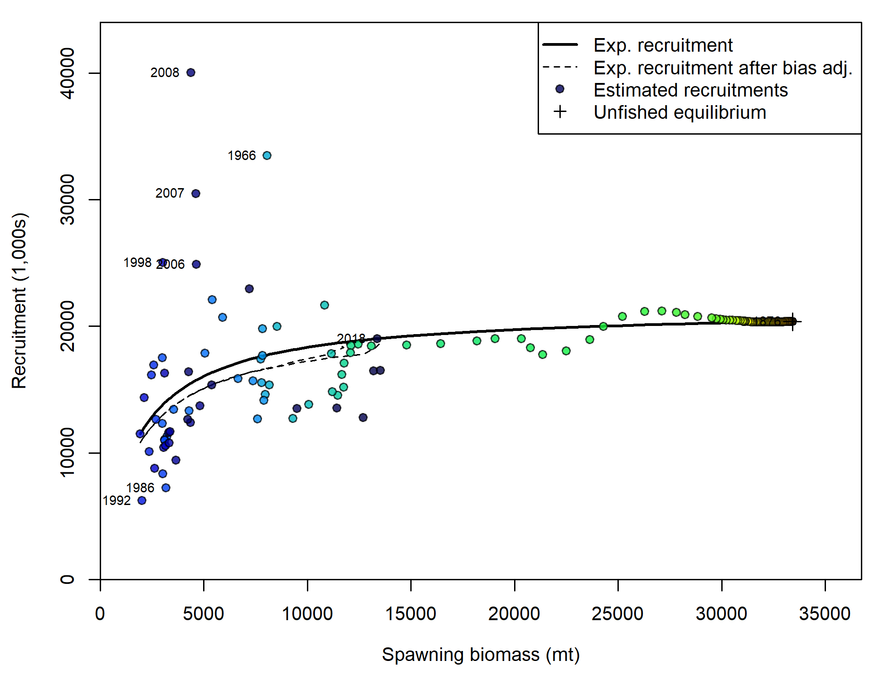

<!-- ====================================================================== -->
<!-- **************************             ******************************* --> 
<!-- **************************BEGIN FIGURES******************************* --> 
<!-- **************************             ******************************* -->
<!-- ====================================================================== -->

#Figures

\FloatBarrier

<!-- ====================================================================== --> 
<!-- *********************INTRODUCTION FIGURES***************************** --> 
<!-- ====================================================================== --> 
  

<!-- ********************************************************************** --> 
<!-- ******************Commercial landings FIGURES************************* --> 
<!-- *************************  FIGURE 1  ********************************* -->
<!-- ********************************************************************** --> 
  

  
\FloatBarrier

<!-- ********************************************************************** --> 
<!-- *************************Data FIGURES********************************* --> 
<!-- *************************  FIGURE 2  ********************************* -->
<!-- ********************************************************************** -->
  

\FloatBarrier

<!-- ********************************************************************** 
<!-- ****************Length and Age Composition FIGURES******************** --> 
<!-- ********************************************************************** -->

<!-- ****************************************************************************** --> 
<!-- *****************Commercial Comps & Discards FIGURES************************** --> 
<!-- ****************************************************************************** -->

<!-- ====================================================================== -->
<!-- *****************                             ************************ -->
<!-- *****************START BIOLOGICAL DATA FIGURES************************ --> 
<!-- *****************                            ************************ -->
<!-- ====================================================================== -->

<!-- ********************************************************************** -->
<!-- *****************Maturity and Fecundity FIGURES*********************** --> 
<!-- ********************************************************************** -->

<!-- ********************************************************************** -->
<!-- **********************Weight-Length FIGURES*************************** --> 
<!-- ********************************************************************** -->

<!-- ********************************************************************** -->
<!-- **********************Length-at-Age FIGURES*************************** --> 
<!-- ********************************************************************** -->

<!-- ********************************************************************** -->
<!-- ****************Aging Precision and Bias FIGURES********************** --> 
<!-- ********************************************************************** -->

<!-- ====================================================================== -->
<!-- ******************                           ************************* -->
<!-- ******************END BIOLOGICAL DATA FIGURES************************* --> 
<!-- ******************                           ************************* -->
<!-- ====================================================================== -->

<!-- ********************************************************************** -->
<!-- **********************Catch Comparison******************************** --> 
<!-- ********************************************************************** -->

<!-- ********************************************************************** -->
<!-- *********************Model Bridging Figure**************************** --> 
<!-- ********************************************************************** -->

<!-- ====================================================================== -->
<!-- *********************BASE MODEL FIGURES******************************* -->
<!-- ====================================================================== -->
  
<!-- ***********MODEL 1 BASE MODEL FIGURES********************************* --> 

<!-- ********************************************************************** -->
<!-- *******************Estimated Length-at-Age**************************** --> 
<!-- ********************************************************************** -->

\FloatBarrier 

<!-- ********************************************************************** -->
<!-- *******************Selectivity & Retention**************************** --> 
<!-- ********************************************************************** -->

<!-- ********************************************************************** -->
<!-- ******************** Estimated Recruitment**************************** --> 
<!-- ********************************************************************** -->

_with_95_asymptotic_intervals.png)
  
\FloatBarrier

  
\FloatBarrier

<!-- ********************************************************************** -->
<!-- ***********************Fits to the Indices**************************** --> 
<!-- ********************************************************************** -->

<!-- ********************************************************************** -->
<!-- *******************Fits to the Discard Data*************************** --> 
<!-- ********************************************************************** -->

  
<!-- ********************************************************************** -->
<!-- ****************Length Composition Fits and EffN********************** --> 
<!-- ********************************************************************** -->

<!-- *************** MEAN LENGTH FITS ********************************-->

\FloatBarrier

<!-- ********************************************************************** -->
<!-- **********************Age structure FIGURES*************************** --> 
<!-- ********************************************************************** -->

<!-- *************** MEAN AGE FITS ********************************-->
 
\FloatBarrier

<!-- ====================================================================== -->
<!-- ********************Time-Series Figures******************************* -->
<!-- ====================================================================== -->

_with_95_asymptotic_intervals_intervals)
  
\FloatBarrier

.png)

\FloatBarrier

  
\FloatBarrier

  
  

<!-- ********************************************************************** -->
<!-- ****************Uncertainty and Sensitivity FIGURES******************* -->
<!-- ********************************************************************** -->
  
<!-- ***********MODEL 1 Uncertainty and Sensitivity FIGURES**************** --> 

  
  
  
<!-- ********************************************************************** -->
<!-- *****************Retrospective analysis FIGURES*********************** -->
<!-- ********************************************************************** -->

<!-- ***********MODEL 1 Retrospective analysis FIGURE********************** --> 

<!-- ********************************************************************** -->
<!-- *****************Historical analysis FIGURES*********************** -->
<!-- ********************************************************************** -->

<!-- ********************************************************************** -->
<!-- ******************Likelihood profile FIGURES************************** --> 
<!-- ********************************************************************** -->

  
<!-- ***********M Likelihood profile FIGURES******************************* -->

  
<!-- ***********R0 Likelihood profile FIGURES******************************* -->

  
  
<!-- ********************************************************************** -->
<!-- *********************REFERENCE POINTS FIGURES************************* --> 
<!-- ********************************************************************** -->
  
<!-- ***********MODEL 1 REFERENCE POINTS FIGURES*************************** --> 

  
  
\FloatBarrier

![Equilibrium yield curve for the base case model. Values are based on the `r Dat_end_mod1` fishery selectivity and with steepness fixed at `r print(mod1$parameters[mod1$parameters$Label == "SR_BH_steep","Value"],2)`. \label{fig:yield}](r4ss/plots_mod1/yield1_yield_curve.png)

\FloatBarrier
  
  
<!-- ********************************************************************** --> 
<!-- *************************FORECAST FIGURES***************************** --> 
<!-- ********************************************************************** --> 
  
\newpage

