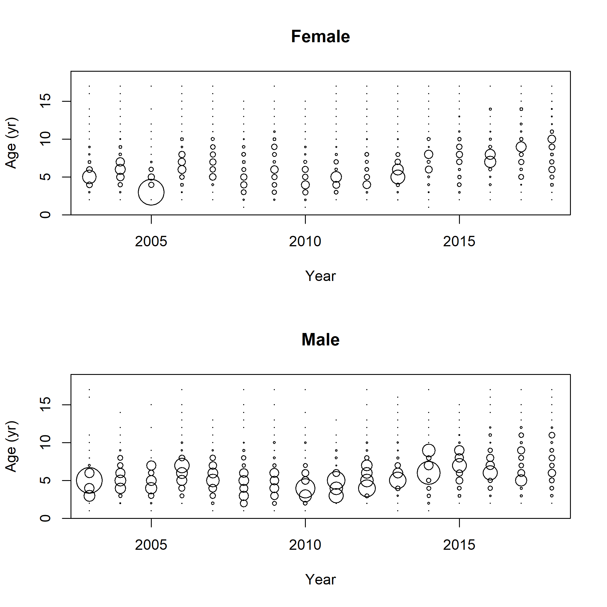
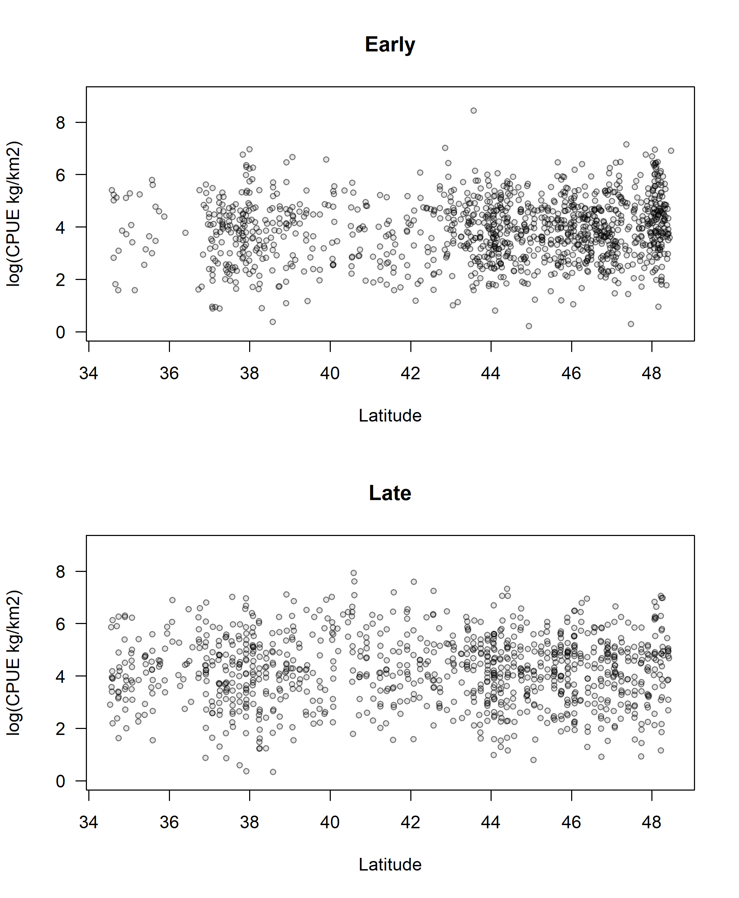
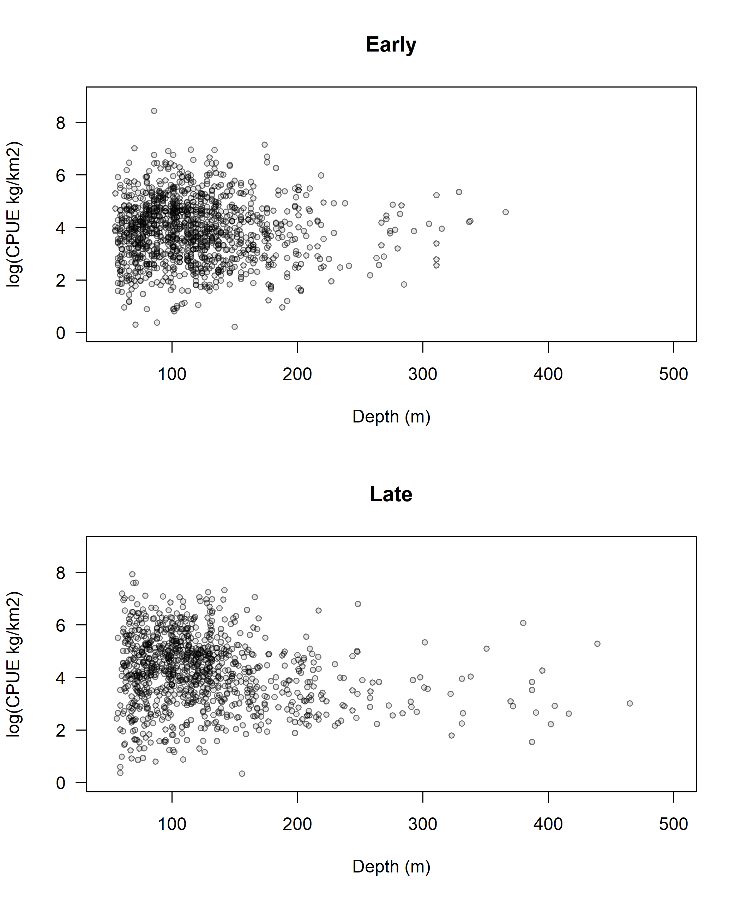
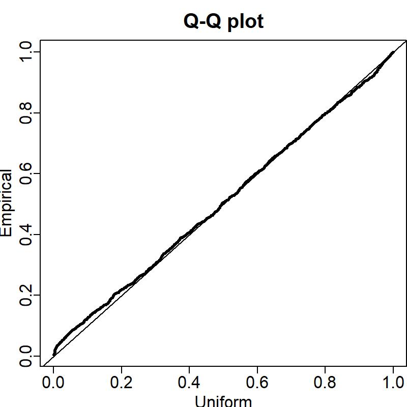
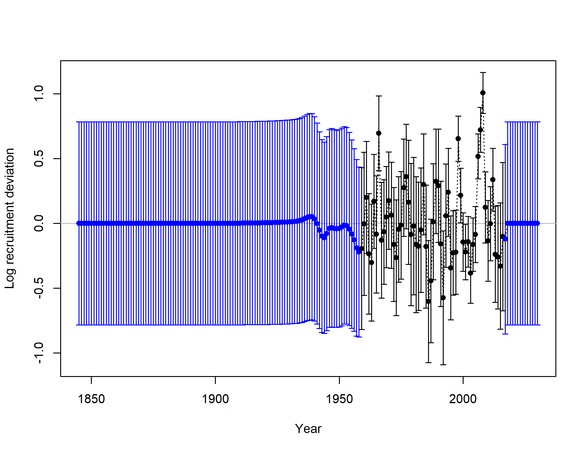
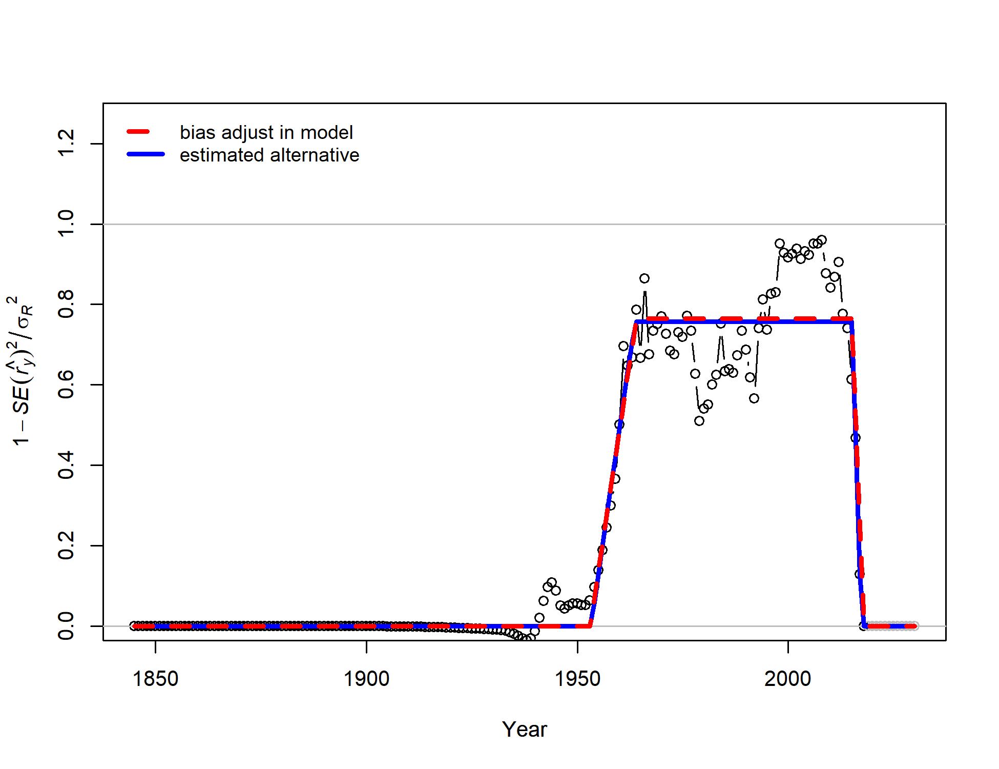

<!-- ====================================================================== -->
<!-- **************************             ******************************* --> 
<!-- **************************BEGIN FIGURES******************************* --> 
<!-- **************************             ******************************* -->
<!-- ====================================================================== -->

#Figures

\FloatBarrier

<!-- ====================================================================== --> 
<!-- *********************INTRODUCTION FIGURES***************************** --> 
<!-- ====================================================================== --> 
  


<!-- ********************************************************************** --> 
<!-- ******************Commercial landings FIGURES************************* --> 
<!-- *************************  FIGURE 1  ********************************* -->
<!-- ********************************************************************** --> 
  

  
\FloatBarrier


<!-- ********************************************************************** --> 
<!-- *************************Data FIGURES********************************* --> 
<!-- *************************  FIGURE 2  ********************************* -->
<!-- ********************************************************************** -->
  


\FloatBarrier


<!-- ********************************************************************** 
<!-- ****************    NWFSC Survey Index and Data   ******************** --> 
<!-- ********************************************************************** -->


\FloatBarrier


\FloatBarrier


\FloatBarrier


\FloatBarrier


\FloatBarrier


\FloatBarrier



\FloatBarrier

<!-- ********************************************************************** 
<!-- **************** Triennial Survey Index and Data  ******************** --> 
<!-- ********************************************************************** -->


\FloatBarrier



\FloatBarrier



\FloatBarrier


\FloatBarrier


\FloatBarrier



\FloatBarrier


\FloatBarrier


\FloatBarrier


\FloatBarrier

<!-- ****************************************************************************** --> 
<!-- ****************    Commercial Discards FIGURES    ************************** --> 
<!-- ****************************************************************************** -->


\FloatBarrier


\FloatBarrier


\FloatBarrier

<!-- ****************************************************************************** --> 
<!-- *****************Commercial CPUE FIGURES************************************** --> 
<!-- ****************************************************************************** -->

.png)

\FloatBarrier


.png)

\FloatBarrier

<!-- ====================================================================== -->
<!-- *****************                             ************************ -->
<!-- *****************START BIOLOGICAL DATA FIGURES************************ --> 
<!-- *****************                            ************************ -->
<!-- ====================================================================== -->

<!-- ********************************************************************** -->
<!-- *****************Maturity and Fecundity FIGURES*********************** --> 
<!-- ********************************************************************** -->


<!-- ********************************************************************** -->
<!-- *****************     Sex Ratio                *********************** --> 
<!-- ********************************************************************** -->


<!-- ********************************************************************** -->
<!-- **********************Weight-Length FIGURES*************************** --> 
<!-- ********************************************************************** -->


<!-- ********************************************************************** -->
<!-- **********************Length-at-Age FIGURES*************************** --> 
<!-- ********************************************************************** -->


<!-- ********************************************************************** -->
<!-- ****************Aging Precision and Bias FIGURES********************** --> 
<!-- ********************************************************************** -->


<!-- ====================================================================== -->
<!-- ******************                           ************************* -->
<!-- ******************END BIOLOGICAL DATA FIGURES************************* --> 
<!-- ******************                           ************************* -->
<!-- ====================================================================== -->


<!-- ********************************************************************** -->
<!-- *****************Natural Mortality FIGURES     *********************** --> 
<!-- ********************************************************************** -->


<!-- ********************************************************************** -->
<!-- *****************    Steepnes      FIGURES     *********************** --> 
<!-- ********************************************************************** -->


<!-- ********************************************************************** -->
<!-- *********************Model Bridging Figure**************************** --> 
<!-- ********************************************************************** -->


\FloatBarrier 


<!-- ====================================================================== -->
<!-- *********************BASE MODEL FIGURES******************************* -->
<!-- ====================================================================== -->
  
<!-- ***********MODEL 1 BASE MODEL FIGURES********************************* --> 


<!-- ********************************************************************** -->
<!-- *******************Estimated Length-at-Age**************************** --> 
<!-- ********************************************************************** -->


\FloatBarrier 


<!-- ********************************************************************** -->
<!-- *******************Estimated Spawning Output**************************** --> 
<!-- ********************************************************************** -->


\FloatBarrier 

<!-- ********************************************************************** -->
<!-- *******************Selectivity & Retention**************************** --> 
<!-- ********************************************************************** -->


<!-- ********************************************************************** -->
<!-- ******************** Estimated Recruitment**************************** --> 
<!-- ********************************************************************** -->

_with_95_asymptotic_intervals.png)
  
\FloatBarrier


  
\FloatBarrier



\FloatBarrier



\FloatBarrier

<!-- ********************************************************************** -->
<!-- ***********************Fits to the Indices**************************** --> 
<!-- ********************************************************************** -->

.png)

\FloatBarrier

.png)

\FloatBarrier

.png)

\FloatBarrier

.png)

\FloatBarrier


\FloatBarrier 


\FloatBarrier 


\FloatBarrier

 
<!-- ********************************************************************** -->
<!-- *******************Fits to the Discard Data*************************** --> 
<!-- ********************************************************************** -->

.png)

\FloatBarrier

.png)

\FloatBarrier

.png)

\FloatBarrier

.png)

\FloatBarrier
  


\FloatBarrier

  
<!-- ********************************************************************** -->
<!-- ****************Length Composition Fits and EffN********************** --> 
<!-- ********************************************************************** -->


\FloatBarrier


```{r, results='asis'}

#Discard - Winter North
cat('\n![', LenComp_mod1[9,caption_col], ' \\label{fig:discard_wn_len_pearson}](r4ss/plots_mod1/', LenComp_mod1[9, path_col], ')\n', sep='')

#Discard - Summer North
cat('\n![', LenComp_mod1[20,caption_col], ' \\label{fig:discard_sn_len_pearson}](r4ss/plots_mod1/', LenComp_mod1[20, path_col], ')\n', sep='')

#Discard - Winter South
cat('\n![', LenComp_mod1[30,caption_col], ' \\label{fig:discard_ws_len_pearson}](r4ss/plots_mod1/', LenComp_mod1[30, path_col], ')\n', sep='')

#Discard - Summer South
cat('\n![', LenComp_mod1[41,caption_col], ' \\label{fig:discard_ss_len_pearson}](r4ss/plots_mod1/', LenComp_mod1[41, path_col], ')\n', sep='')

#Winter North
cat('\n![', LenComp_mod1[5,caption_col], ' \\label{fig:wn_len_pearson}](r4ss/plots_mod1/', LenComp_mod1[5, path_col], ')\n', sep='')

#Summer North
cat('\n![', LenComp_mod1[16,caption_col], ' \\label{fig:ws_len_pearson}](r4ss/plots_mod1/', LenComp_mod1[16, path_col], ')\n', sep='')

#Winter South
cat('\n![', LenComp_mod1[26,caption_col], ' \\label{fig:sn_len_pearson}](r4ss/plots_mod1/', LenComp_mod1[26, path_col], ')\n', sep='')

#Summer South
cat('\n![', LenComp_mod1[37,caption_col], ' \\label{fig:ss_len_pearson}](r4ss/plots_mod1/', LenComp_mod1[37, path_col], ')\n', sep='')

#Tri Early
cat('\n![', LenComp_mod1[45,caption_col], ' \\label{fig:tri_len_pearson}](r4ss/plots_mod1/', LenComp_mod1[45, path_col], ')\n', sep='')

#Tri Late
cat('\n![', LenComp_mod1[49,caption_col], ' \\label{fig:tri_len_pearson}](r4ss/plots_mod1/', LenComp_mod1[49, path_col], ')\n', sep='')


#NWFSC Combo
cat('\n![', LenComp_mod1[53,caption_col], ' \\label{fig:nwfsc_combo_len_pearson}](r4ss/plots_mod1/', LenComp_mod1[53, path_col], ')\n', sep='')

```


<!-- ********************************************************************** -->
<!-- **********************Age structure FIGURES*************************** --> 
<!-- ********************************************************************** -->


 
\FloatBarrier


<!-- ====================================================================== -->
<!-- ********************Time-Series Figures******************************* -->
<!-- ====================================================================== -->

_with_95_asymptotic_intervals_intervals)
  
\FloatBarrier

.png)

\FloatBarrier


  
\FloatBarrier


\FloatBarrier

  
  

<!-- ********************************************************************** -->
<!-- ****************Uncertainty and Sensitivity FIGURES******************* -->
<!-- ********************************************************************** -->
  
<!-- ***********MODEL 1 Uncertainty and Sensitivity FIGURES**************** --> 

  
  
  
<!-- ********************************************************************** -->
<!-- *****************Retrospective analysis FIGURES*********************** -->
<!-- ********************************************************************** -->

<!-- ***********MODEL 1 Retrospective analysis FIGURE********************** --> 


<!-- ********************************************************************** -->
<!-- *****************Historical analysis FIGURES*********************** -->
<!-- ********************************************************************** -->


<!-- ********************************************************************** -->
<!-- ******************Likelihood profile FIGURES************************** --> 
<!-- ********************************************************************** -->

  
<!-- ***********M Likelihood profile FIGURES******************************* -->

  
<!-- ***********R0 Likelihood profile FIGURES******************************* -->

  
  
<!-- ********************************************************************** -->
<!-- *********************REFERENCE POINTS FIGURES************************* --> 
<!-- ********************************************************************** -->
  
<!-- ***********MODEL 1 REFERENCE POINTS FIGURES*************************** --> 


  
  
\FloatBarrier

![Equilibrium yield curve for the base case model. Values are based on the `r Dat_end_mod1` fishery selectivity and with steepness fixed at `r print(mod1$parameters[mod1$parameters$Label == "SR_BH_steep","Value"],2)`. \label{fig:yield}](r4ss/plots_mod1/yield1_yield_curve.png)

\FloatBarrier
  
  
<!-- ********************************************************************** --> 
<!-- *************************FORECAST FIGURES***************************** --> 
<!-- ********************************************************************** --> 
  
\newpage

